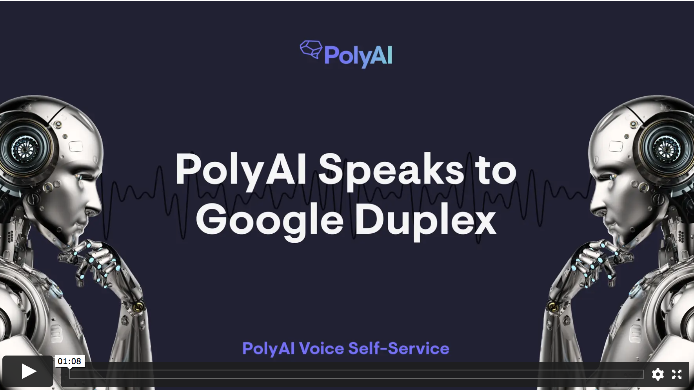

## 인공지능 비서끼리의 전화 업무: PolyAI & Google Duplex

Yoon Kyung Lee

_영국의 인공지능 비서 Poly AI와 구글의 인공지능 비서 Google Duplex가 서로의 업무를 위해 대화를 나누고 있다._

     "뚜루루루루루"

신호음이 짧게 울린 다음 인공지능 점원의 친절한 안내가 나온다.

    "안녕하세요? 저희 이제 영업 시작합니다. 저는 디지털 상담원입니다. 예약을 도와드리거나 고객님의 안전을 위해 어떠한 조치를 취하고 있는지에 대해 안내해드릴 수 있습니다. 무엇을 도와드릴까요?"

<역주: *'고객의 안전을 위한 조치'는 코로나로 인해서 어떠한 방역 조치를 하고 있는지를 뜻하는 듯 하다.*>

잠시 후 통화기 너머로 젊은 목소리의 남성의 목소리가 들린다.

    남자: "여보세요?"

    여자: "네, 무엇을 도와드릴까요?"

    남자: "안녕하세요. **구글지도**에서 연락드립니다. 지금 상황이 이렇다보니 오늘 오픈하시는지 알려고 전화드렸어요. 저는 자동 서비스이기때문에 이 통화는 모니터링되고 있어요. 오늘 언제 열고 닫으시나요?"

    여자: "오늘 아침 식사 시간대 영업 시간은 오전 6시 30분 부터 10시 30분이고요. 점심과 저녁은 12시 30분부터 9시까지입니다.

    남자: "죄송한데, 10시 30분부터 9시까지 여신다는 거죠? "

    여자: "언제 방문하실 건가요?

    남자: "(여자 말을 끊으며) 좋아요. 알려줘서 고맙습니다...아, 그냥 오늘 열어서 언제까지 하는지 궁금해서 전화한거라서요. 감사합니다"

남자가 일방적으로 전화를 끊으며 통화는 종료된다. 

위 대화는 영국의 음성기반 인공지능 비서 스타트업 **PolyAI**에서 공개한 PolyAI 자동 예약 서비스 AI와 **Google Duplex**가 대화를 나눈 내용이다.구글AI Duplex는 2년 전쯤에 구글 개발자 컨퍼런스에서 실제 사람과 대화를 나누며 데뷔한 음성AI비서이다.

*[원본 링크](https://www.polyai.com/our-voice-assistant-spoke-to-google-duplex-heres-what-happened/*)

텍스트로만 보면 인공지능끼리 대화를 시킨건가? 요즘 아마존 에코랑 구글 어시스턴트끼리 대화 나누게 하는 장난도 많이 보이던데, 그런건가? 라는 생각이 들 수 있다. 하지만 영상에서 흘러나오는 목소리를 들어보니 PolyAI보다는 Google Duplex의 제법 사람다운 목소리와 말투가 놀랍다.

2017년에 구글 CEO 선다 피차이가 처음으로 Google Duplex를 선보인 이후로 두번째 보게 되었는데, 그 사이에 많이 더 자연스러워진 것 같다. 그때도 제법 자연스러운 대화를 나눌 수 있어서 놀랐는데, 그 이유야 많겠지만 심리학 전공자 입장에서 보았을 때는 추임새(mmhm, yeah, hmmm)의 역할이 크지 않았을까 싶다. (물론 그 사람은 자신이 AI랑 대화하고 있는건지 아닌지 모르거나 갸우뚱 했을 것 같다).

구글 Duplex 데모 (2017) 영상

구글 듀플렉스는 점원이 "잠시만요"라고 했을때 "음흠~"이라고 했을때, 사람들의 환호가 터져나왔다.여기서 "음흠~"은 미국에서 보통 긍정이나 동의를 표할때 쓰는 추임새이다. 우리 나라라면 "응"이나 "어어" 이런것과 비슷하다고 볼 수 있다.

당시 데모를 보았을땐 '너무 좋은 사례만 골라서 보여준건가?' 라고 생각도 했었다. 위에 PolyAI랑 한 대화를 보니 그때보다 더 자연스러워진 것 같아서 놀랐다. 미국에서 유학 중인 랩메이트가 본인도 예전에 At&t인가 어디쪽에 상담원 전화를 하고 있었는데, 한참 하다가 문득 혹시 사람이 아닌가 ? 란 생각이 들어서 호기심에 Are you a real person이라고 물어본적이 있었다고 한다. 그러자 (기계)상담원이 "아니다, 담당자는 지금 추수감사절이라 휴가갔다"고 대답해줬다고 하더라. 사실 automated된 대답이긴 하지만 (그리고 이렇게 짜는건 생각보다 쉽긴 하지만 상대방의 말을 잘 인식해서 '그럴듯한' 대화로 이끌어가는 건 쉽지 않다). 그런데 이번 poly ai와 duplex끼리의 대화는 그때 들은것보다 훨씬 더 소름이라고 하더라. 그래서 어떻게 얘기를 해야 사람같은지, 로봇인가?라는 생각을 하게끔 만드는 그 미묘한 차이가 무엇인지 많이 궁금해질 것 같다(추임새, 음률, 말하는 박자, 뜸을 들이는 행위 등)

이제 웬만한 (사람이 쓰는) 언어적 표현은 다 자연스럽게 잘한다는 것을 안다. 그리고 우리들은 이제 더 놀랄만한게 있나? 싶을때 생각보다 단순한 요소 하나로 인해 많이 놀라는 것 같다.  추임새는  '의미'가 담겨있지 않은 신호이다. "아~"라고 하지만, "아" 자체의 단어에는 의미가 없다. "아"를 상대방의 말에 대한 동감 또는 동의를 표하기 위해 아~~ 하는 것과, 놀라거나 문뜩 소름이 돋을때 "아!"하는 것은 전혀 다른 의미를 전달한다. 정확히 말하면, 말하는 사람과 듣는 사람 모두 이 "아"라는 소리의 높낮이, 길이, 박자, 타이밍 등으로 인해 다른 의미를 '부여'한다.

사람 같은, 또는 사람 같게 느껴지는 AI기술이 나날이 발전함에 따라 Brian Christian의 The Most Human Human 책에서 소개한 '가장 인간다운 인간' 경진 대회 같은 연구가 더 파생될 수도 있을 것이다.

YK
